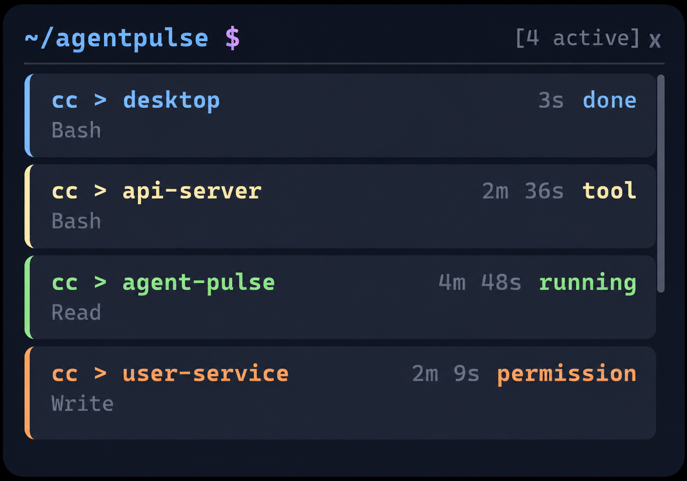
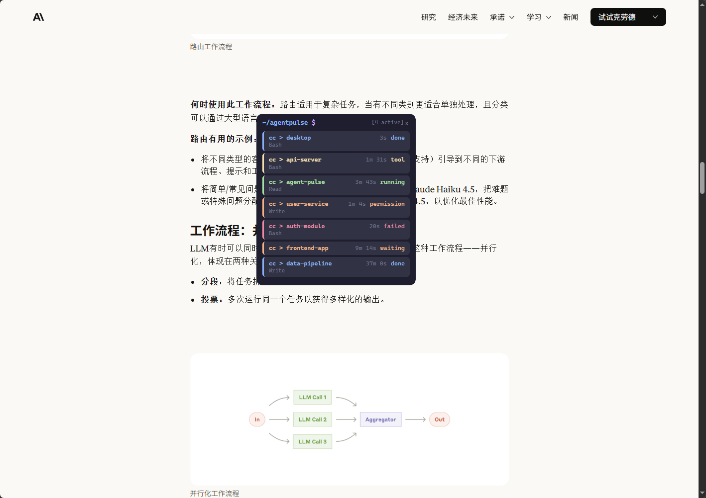

# AgentPulse

<p align="center">
  <strong>本地 AI Coding Agent 桌面监控器</strong><br>
  通过悬浮窗实时展示 Claude Code 等 CLI coding agent 的运行状态
</p>

<p align="center">
  
  
  
</p>

---

## 这是什么

使用 Claude Code（或其他 CLI AI agent）时，你需要在终端之间来回切换才能看到 agent 在做什么 —— 尤其当你同时开启多个终端、跑多个 CC 会话时，完全无法掌握全局状态。

AgentPulse 用一个**桌面悬浮窗**解决这个问题：它通过 Claude Code hooks 自动捕获 session 生命周期事件，在置顶浮窗中为每个 CC 终端生成一张状态卡片。项目名、当前状态、正在调用什么工具、已经跑了多久 —— 不再需要切回终端看日志。

<p align="center">
  
  
</p>

## 核心能力

- **零侵入监控** — 一行命令安装 Claude Code hooks，之后每次启动 CC、调用工具、完成任务，AgentPulse 自动感知。无需修改 CC 配置或工作流
- **桌面悬浮窗** — 无边框、始终置顶、半透明深色主题（Catppuccin Mocha），自适应高度，可拖拽。终端风格的等宽字体，信息密度高但不干扰正常工作
- **多会话对应** — 面板卡片数与正在运行的 CC 终端数一一对应。同时跑 3 个 CC 终端，浮窗就显示 3 张卡片
- **会话完成后保留** — 任务完成后卡片不会立即消失，而是标记为 `[done]` 状态保留在面板中。关闭 CC 终端约 5 秒后卡片自动清理，给你时间确认结果
- **进程存活检测** — 通过 Windows 进程树遍历获取 CC 真实 PID（node.exe），Rust 后台线程定期检测 PID 存活状态，进程退出后自动清理对应 session
- **系统托盘** — 关闭窗口最小化到托盘而非退出。首次关闭时询问偏好（托盘/退出），可记住选择。右键托盘菜单可随时退出
- **规范化状态机** — 从 Starting → Running → ToolRunning → WaitingInput/WaitingPermission → Completed/Failed，以统一模型规范化 CC hook 事件
- **结构化日志** — tracing 日志输出到 stderr（开发）和 JSON 文件（持久化诊断），支持按模块过滤
- **可配置化** — 配置文件 `config.json` 管理端口、轮询间隔、进程检查间隔，环境变量可覆盖（CI 友好）
- **本地优先** — SQLite 持久化存储，所有数据在本地。不上传源码，不上传对话记录，不连外网
- **多源预留** — AgentSource 枚举已支持 Claude Code / Codex / Gemini / Copilot 四种来源

## 下载安装

### 方式一：下载安装包（推荐）

从 [GitHub Releases](https://github.com/Ze-d/AgentPulse/releases) 下载最新版本：

- **Windows (x64)**: `.msi` 安装包 或 `.exe` 独立安装程序
- **macOS (x64 / arm64)**: `.dmg`
- **Linux (x64)**: `.deb` / `.AppImage`

下载后双击安装即可。启动 AgentPulse 后，桌面会出现悬浮窗。

### 方式二：从源码构建

环境要求：

| 工具 | 最低版本 | 用途 |
|------|---------|------|
| Node.js | >= 18 | 前端构建 |
| Rust | >= 1.70 (MSVC toolchain) | Tauri 后端 + Hook 适配器 |

```powershell
# 克隆仓库
git clone https://github.com/Ze-d/AgentPulse.git
cd AgentPulse

# 安装前端依赖
cd apps/desktop
npm install

# 构建应用（输出到 apps/desktop/src-tauri/target/release/bundle/）
npm run tauri build
```

## 使用指南

### 1. 安装 Claude Code hooks

AgentPulse 运行后，需要让 Claude Code 知道把事件发给它：

```powershell
# 预览操作（不会修改任何文件）
agentpulse-hook dry-run

# 安装 hooks 到 ~/.claude/settings.json
agentpulse-hook install

# 检查安装状态
agentpulse-hook status
```

这会向 `~/.claude/settings.json` 写入 6 个 hook 事件：SessionStart、PreToolUse、PostToolUse、PostToolUseFailure、Notification、Stop。安装前会自动备份原文件。

AgentPulse 启动时会自动检测并安装 hooks（幂等操作），无需手动执行。

### 2. 启动 AgentPulse

- 如果下载了安装包：从开始菜单或桌面快捷方式启动
- 如果从源码启动：`cd apps/desktop && npm run tauri dev`

首次启动会在 `{app_data_dir}/` 下生成 `config.json`，可编辑自定义端口、轮询间隔等。

### 3. 正常使用 Claude Code

之后正常使用 Claude Code 即可。AgentPulse 浮窗会自动显示所有 CC session 的状态。不需要任何额外操作。

### 4. 卸载 hooks

```powershell
agentpulse-hook remove
```

## 配置

编辑 `{app_data_dir}/com.agentpulse.desktop/config.json`：

```json
{
  "port": 17878,
  "checkIntervalSecs": 5,
  "pollIntervalMs": 2000
}
```

| 字段 | 默认值 | 说明 |
|------|--------|------|
| `port` | `17878` | HTTP 事件服务器端口 |
| `checkIntervalSecs` | `5` | 进程存活检查间隔（秒） |
| `pollIntervalMs` | `2000` | 前端轮询间隔（毫秒） |

环境变量 `AGENTPULSE_PORT`、`AGENTPULSE_CHECK_INTERVAL`、`AGENTPULSE_POLL_INTERVAL` 可覆盖配置文件。

## 架构

```
Claude Code session 事件
  → ~/.claude/settings.json (hooks 配置)
    → agentpulse-hook (Rust 二进制, 进程树遍历获取 agent PID)
      → POST /api/events (127.0.0.1:{port})
        → event_server.rs (规范化 + 状态机)
          → SQLite (持久化)
            → Tauri commands (IPC)
              → Vue 3 前端 (轮询展示全部 session 卡片)
        → process_checker.rs (轮询 PID 存活, 自动清理)
```

| 层 | 技术 |
|---|------|
| 桌面壳 | Tauri 2 |
| 前端 | Vue 3 + TypeScript + Pinia |
| 样式 | Catppuccin Mocha 配色 + 等宽字体 |
| 后端 | Rust (agentpulse_lib) |
| HTTP 服务 | tiny_http 0.12 (端口可配置，默认 17878) |
| 数据库 | SQLite (rusqlite 0.31, bundled, 内存 / 文件) |
| 进程监控 | sysinfo 0.31 (跨平台 PID 存活检测) |
| 日志 | tracing (stderr 文本 + JSON 文件轮转) |
| 配置 | config.json + 环境变量覆盖 |
| 适配器 | Rust (agentpulse-hook, 零依赖二进制) |

## 项目结构

```
AgentPulse/
├── apps/desktop/                  # Tauri 桌面应用
│   ├── src/                       # Vue 3 前端
│   │   ├── components/            # FloatingPanel, SessionCard, ExpandedDetail
│   │   ├── composables/           # useSessionDisplay
│   │   ├── stores/                # Pinia sessionStore (轮询)
│   │   ├── types/                 # TypeScript 类型定义
│   │   └── utils/                 # ipc, logger, sourceDisplay, openActions
│   ├── src-tauri/                 # Rust 后端
│   │   ├── src/
│   │   │   ├── lib.rs             # 共享类型 + run() 入口
│   │   │   ├── config.rs          # 配置文件加载 + 环境变量覆盖
│   │   │   ├── db.rs              # SQLite CRUD + cleanup
│   │   │   ├── state_machine.rs   # 状态转换 + needs_attention
│   │   │   ├── event_server.rs    # HTTP 服务器 (tiny_http)
│   │   │   ├── process_checker.rs # 后台进程存活检测
│   │   │   ├── commands.rs        # Tauri IPC 命令
│   │   │   ├── hooks.rs           # Hook 配置管理
│   │   │   ├── logging.rs         # tracing 日志初始化
│   │   │   ├── tray.rs            # 系统托盘
│   │   │   └── main.rs            # 二进制入口
│   │   └── tests/                 # Rust 集成测试
│   └── tauri.conf.json
├── adapters/hook-adapter/         # Hook 适配器 (Rust 二进制)
│   └── agentpulse-hook            # 零依赖 hook 适配器 (stdin → HTTP + CLI 安装管理)
├── tests/
│   └── integration/               # E2E 冒烟测试
├── docs/                          # 文档
│   ├── architecture/              # 架构设计
│   ├── flows/                     # 功能流程文档 (10 篇)
│   ├── testing/                   # 测试策略 + TDD 指南
│   ├── ai/                        # AI 协作规范
│   ├── superpowers/               # 设计文档 + 实现计划
│   ├── fixlog/                    # Bug 修复记录
│   ├── todos/                     # 未完成待办
│   └── workflow/                  # 发布流程
└── asset/                         # README 截图
```

## 本地开发

```powershell
# 进入 Tauri 应用目录
cd apps/desktop

# 安装前端依赖
npm install

# 验证 Rust 编译环境（首次需下载依赖）
cd src-tauri && cargo check && cd ..

# 启动 Tauri 开发模式（前端热更新 + Rust 后端 + 悬浮窗）
npm run tauri dev

# 仅启动前端（不需要 Rust 后端，在浏览器预览 UI）
npm run dev
```

**调试技巧：**
- 前端代码修改后自动热更新
- Rust 代码修改后自动重编译
- 悬浮窗右键 → Inspect 打开 Chrome DevTools
- 设置 `$env:RUST_LOG = "debug"` 查看 Rust 详细日志
- 日志文件位于 `{app_data_dir}/com.agentpulse.desktop/logs/`

### 模拟事件测试

AgentPulse 运行期间，可以用 curl 手动发送事件测试：

```powershell
# 健康检查
curl http://127.0.0.1:17878/api/health

# 模拟 SessionStart
curl -X POST http://127.0.0.1:17878/api/events `
  -H "Content-Type: application/json" `
  -d '{"session_id":"test-001","cwd":"D:/projects/demo","hook_event_name":"SessionStart","process_pid":4}'

# 模拟 PreToolUse
curl -X POST http://127.0.0.1:17878/api/events `
  -H "Content-Type: application/json" `
  -d '{"session_id":"test-001","cwd":"D:/projects/demo","hook_event_name":"PreToolUse","tool_name":"Bash"}'

# 模拟 Stop（任务完成）
curl -X POST http://127.0.0.1:17878/api/events `
  -H "Content-Type: application/json" `
  -d '{"session_id":"test-001","cwd":"D:/projects/demo","hook_event_name":"Stop"}'
```

### 运行测试

```powershell
# Rust 测试 (53+ 个)
cd apps/desktop/src-tauri && cargo test

# 前端类型检查
cd apps/desktop && npx vue-tsc --noEmit

# 前端单元测试
cd apps/desktop && npm test
```

## 打包发布

```powershell
cd apps/desktop
npm run tauri build
```

产物输出到 `apps/desktop/src-tauri/target/release/bundle/`：
- Windows: `.msi` + `.exe` (NSIS installer)
- macOS: `.dmg`
- Linux: `.deb` + `.AppImage`

推送 `v*` 格式的 tag 可触发 GitHub Actions 自动构建并发布到 GitHub Release。

## 常见问题

**Q: `cargo check` 报 rusqlite 编译错误？**

需要 MSVC 工具链（而非 GNU）：`rustup default stable-x86_64-pc-windows-msvc`

**Q: 启动后窗口不显示？**

检查 `tauri.conf.json` 中 `"visible": true`。或检查系统托盘中是否有 AgentPulse 图标，可能窗口被最小化到托盘了。

**Q: 前端能打开但 Rust 调用报错？**

确认是用 `npm run tauri dev` 启动的（不是 `npm run dev`），后者只启 Vite，没有 Rust 后端。

**Q: curl POST 返回 400？**

检查 JSON 格式。Windows PowerShell 的 curl 需要用反引号 `` ` `` 续行，且 JSON 内部只能用双引号。

**Q: session 卡片不消失？**

如果 SessionStart 事件丢失（导致 session 没有 PID），卡片不会被自动清理。重启 AgentPulse 即可清除。正常情况下关闭 CC 终端约 5 秒后卡片自动消失。

**Q: 想改端口怎么办？**

编辑 `{app_data_dir}/com.agentpulse.desktop/config.json`，修改 `port` 字段，重启生效。

## 文档索引

- [本地开发指南](docs/local-development-guide.md)
- [架构概述](docs/architecture/overview.md)
- [组件树](docs/architecture/component-tree.md)
- [模块边界](docs/architecture/module-boundaries.md)
- [流程文档](docs/flows/README.md) — 10 篇功能流程
- [测试策略](docs/testing/testing-strategy.md)
- [TDD 指南](docs/testing/tdd-guide.md)
- [代码规范](docs/ai/coding-rules.md)
- [审查清单](docs/ai/review-checklist.md)
- [发布流程](docs/workflow/release.md)
- [Bug 修复记录](docs/fixlog/)

## 路线图

- [x] **v0.3** — 跨平台 CI、lint 门控、安全审计、前端测试
- [x] **v0.4** — 配置系统（config.json）、tracing 结构化日志、流程文档
- [ ] **v0.5** — Codex / Gemini / Copilot 适配器、对话记录解析
- [ ] **v1.0** — 插件架构，支持第三方 agent 接入

## 许可证

MIT © [Kal_zed](https://github.com/Kal_zed)
